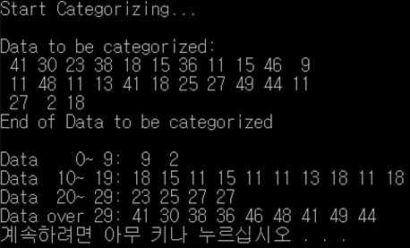

## Index

#### 1. Definition

#### 2. Problem

#### 3. Algorithm

#### 4. How to Use?

#### 5. Conclusion

#### 

## 1. Definition

According to Wikipedia, A **queue** is a basic data structure that is used throughout programming. You can think of it as a line in a grocery store. The first one in the line is the first one to be served.Just like a queue.

A queue is also called a FIFO (First In First Out) to demonstrate the way it accesses data.


## 2. Problem

Build a array-based circular queue and categorize natural numbers.

For example,

> Input : 11 23 7 8 15
>
> Output : 0 to 9 - 7 8
>
> ​		10 to 19 - 11 15
>
> ​		20 to 29 - 23


## 3. Algorithm

First, define "_cQueue".

```c
typedef struct _cQueue
{
	int front;
	int rear;
	Data queArr[QUE_LEN];
}CQueue;
```


Second, build functions: QueueInit, QIsEmpty, Enqueue, Dequeue, QPeek, and NextPosldx.

```c
int NextPosIdx(int pos)
{
	if (pos == QUE_LEN - 1)
		return 0;
	else
		return pos + 1;
}
```

```c
void QueueInit(Queue * pq)
{
	pq->front = 0;
	pq->rear = 0;
}
```

```c
int QIsEmpty(Queue * pq)
{
	if (pq->front == pq->rear)
	{
		return TRUE;
	}
	else
	{
		return FALSE;
	}
}
```

```c
void Enqueue(Queue * pq, Data data)
{
	if (NextPosIdx(pq->rear) == pq->front)
	{
		printf("Queue Memory Error!");
		exit(-1);
	}

	pq->rear = NextPosIdx(pq->rear);
	pq->queArr[pq->rear] = data;

}
```

```c
Data Dequeue(Queue * pq)
{
	if (QIsEmpty(pq))
	{
		printf("Queue Memory Error!");
		exit(-1);
	}

	pq->front = NextPosIdx(pq->front);
	return pq->queArr[pq->front];
}
```

```c
Data QPeek(Queue * pq)
{
	if (QIsEmpty(pq))
	{
		printf("Queue Memory Error!");
		exit(-1);
	}
	
	return pq->queArr[pq->front];
}
```

```c
void fillQueues(Queue* q0to9, Queue* q10to19, Queue* q20to29, Queue* qOver29)
{
	int category;
	int item;
	int* dataPtr;

	printf("Data to be categorized:\n");
	srand(79);

	for (int i = 1; i <= 25; i++)
	{
		if (!(dataPtr = (int*)malloc(sizeof(int))))
		{
			printf("Overflow in fillQueues\a\n");
			exit(100);
		}

		*dataPtr = item = rand() % 51;
		category = item / 10;
		printf("%3d", item);
		if (!(i % 11))
			printf("\n");

		switch (category)
		{
		case 0: Enqueue(q0to9, *dataPtr);
			break;
		case 1: Enqueue(q10to19, *dataPtr);
			break;
		case 2: Enqueue(q20to29, *dataPtr);
			break;
		default: Enqueue(qOver29, *dataPtr);
			break;
		}
	
	}
	printf("\nEnd of Data to be categorized\n\n");
}
```

```c
void printOneQueue(Queue* pQueue)
{
	int lineCount;
	Data * dataPtr;

	dataPtr = (Data*)malloc(sizeof(Data));
	
	lineCount = 0;
	while (!QIsEmpty(pQueue))
	{
		*dataPtr = Dequeue(pQueue);
		printf("%3d", *dataPtr);

		if (lineCount++ >= 10)
		{
			lineCount = 1;
			printf("\n             ");
		}
	}
	printf("\n");

	return;
}
```

```c
void printQueues(Queue* q0to9, Queue* q10to19, Queue* q20to29, Queue* qOver29)
{
	printf("Data    0~ 9:");
	printOneQueue(q0to9);

	printf("Data  10~ 19:");
	printOneQueue(q10to19);

	printf("Data  20~ 29:");
	printOneQueue(q20to29);

	printf("Data over 29:");
	printOneQueue(qOver29);

	return;
}
```


Third, build a main function.

```c
int main()
{
	Queue * q0to9;
	Queue * q10to19;
	Queue * q20to29;
	Queue * qOver29;

	q0to9 = (Queue*)malloc(sizeof(Queue));
	q10to19 = (Queue*)malloc(sizeof(Queue));
	q20to29 = (Queue*)malloc(sizeof(Queue));
	qOver29 = (Queue*)malloc(sizeof(Queue));

	printf("Start Categorizing...\n\n");

	QueueInit(q0to9);
	QueueInit(q10to19);
	QueueInit(q20to29);
	QueueInit(qOver29);

	fillQueues(q0to9, q10to19, q20to29, qOver29);
	
	printQueues(q0to9, q10to19, q20to29, qOver29);

	return 0;
}
```


## 4. How to Use?

First, compile Array_Based_Circular_Queue.c

```c++
gcc -o Array_Based_Circular_Queue Array_Based_Circular_Queue.c
```


Second, execute the program.

```c++
sudo ./Array_Based_Circular_Queue
```


## 5. Conclusion

You can check the conclusion: Twenty-five random numbers less than 50 and the categorized data.

