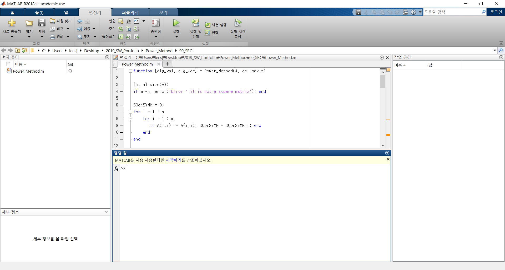
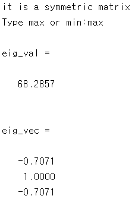
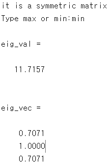

## Index

#### 1. Definition

#### 2. Problem

#### 3. Algorithm

#### 4. How to Use?

#### 5. Conclusion

#### 

## 1. Definition

According to Wikipedia, power method is an eigenvalue algorithm which can be used to find the eigenvalue with the largest absolute value.

> In linear algebra, an eigenvector or characteristic vector of a linear transformation is a nonzero vector that changes at most by a scalar factor when that linear transformation is applied to it. The corresponding **eigenvalue** is the factor by which the eigenvector is scaled.


## 2. Problem

Using MATLAB, build a power method algorithm. With the algorithm, check if it works using a given symmetric matrix A. Find a maximum eigenvalue, a minimum one, and a corresponding eigenvector.


$$
A=\begin{pmatrix}40&-20&0\\-20&40&-20\\0&-20&40 \end{pmatrix}
$$


## 3. Algorithm

```matlab
function [eig_val, eig_vec] = power_method(A, es, maxit)

[m, n]=size(A);
if m~=n, error('Error : it is not a square matrix'); end

SQorSYMM = 0;
for i = 1 : n
    for j = 1 : m
       if A(i,j) ~= A(j,i), SQorSYMM = SQorSYMM+1; end
    end   
end

if SQorSYMM ~= 0, disp('it is not a symmetric matrix'); error('It is not a symmetric matrix')
else
    disp('it is a symmetric matrix')
    
    it = 0;
    ea = 100;
    x = ones(m,1);
    eig_val_temp = 1;

    selection=input('Type max or min:', 's');

    switch selection
        case 'max'
        while(1)
            if ea <= es || it >= maxit, break, end
            x = A*x;
            temp =x(1);
            for i = 2:n
                if abs(temp) <= abs(x(i)), temp = x(i);end
            end 
            x = x/ temp;
            eig_vec_temp = x;
            ea = abs((temp - eig_val_temp)/temp*100);
            
            eig_val_temp = temp;
            it=it+1;
        end        

        case 'min'
        A=inv(A);
        while 1
            if ea <= es || it >= maxit, break, end
            x = A*x;
            temp =x(1);
            for i = 2:n
                if abs(temp) <= abs(x(i)), temp = x(i);end
            end 
            x = x/ temp;
            eig_vec_temp = x;
            ea = abs((temp - eig_val_temp)/temp*100);
            
            eig_val_temp = 1/temp;
            it=it+1;
        end
    end
    
 eig_val = eig_val_temp
 eig_vec = eig_vec_temp
end
```


## 4. How to Use?

First, download MATLAB and Power_Method.m, and execute Power_Method.m




Second, feed required data on a command window.

```matlab
>> A = [ 40 -20 0 ; -20 40 -20 ; 0 -20 40];
>> es = 0.05 ; maxit = 100;
```


Third, execute the program.

```matlab
>> [ eig_val, eig_vec ] = Power_Method(A, es, maxit)
```


Fourth, input "max" or "min" to see maximum eigenvalue or minimum eigenvalue respectively.

```matlab
>> Type max or min : 
```


## 5. Conclusion

Check the maximum and minimum eigenvalue and the corresponding eigenvecgtors.





The algorithm checked whether it is a symmetric matrix or not and find maximum eigenvalue and corresponding eigenvector.





And find maximum eigenvalue and corresponding eigenvector.