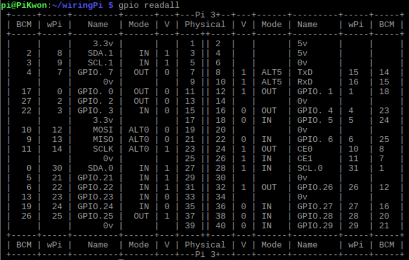
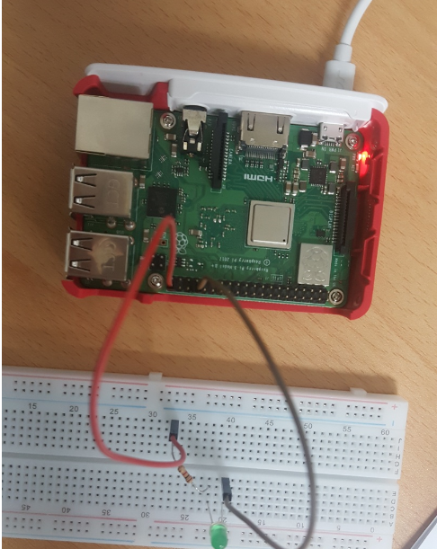
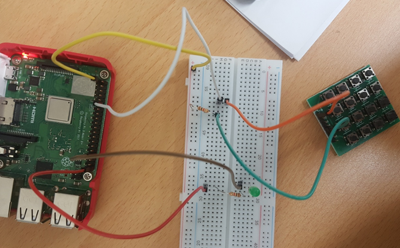
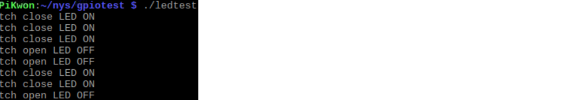
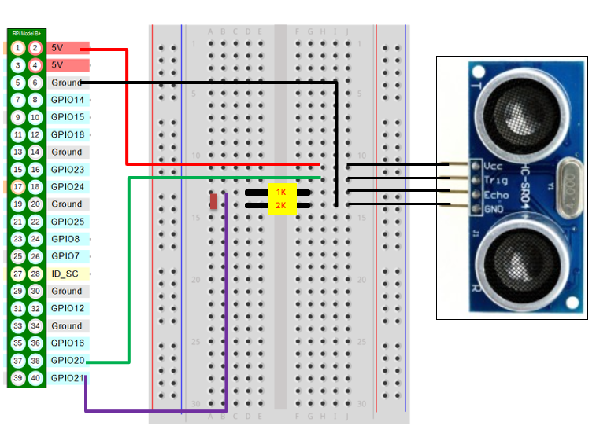
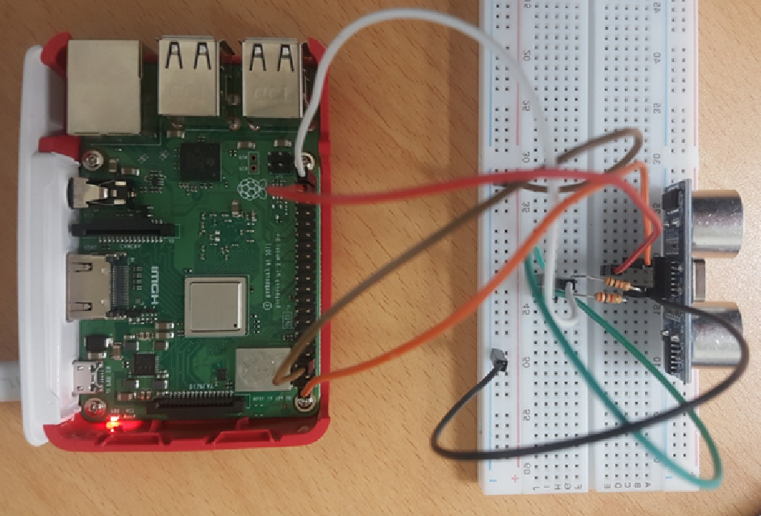
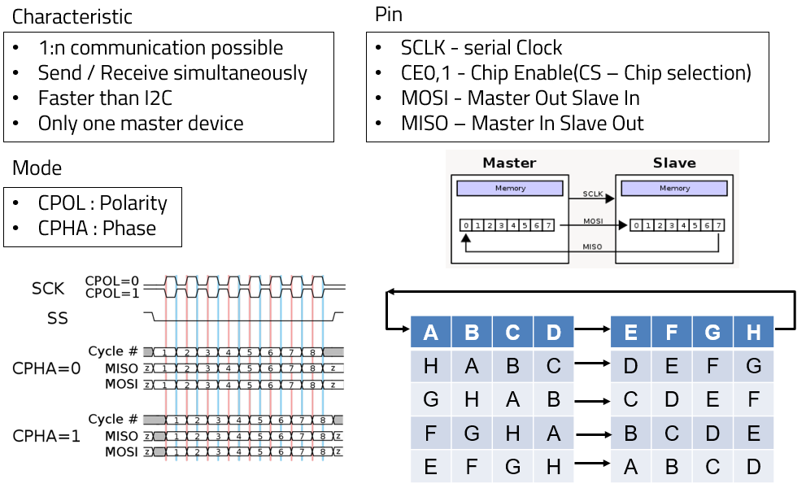
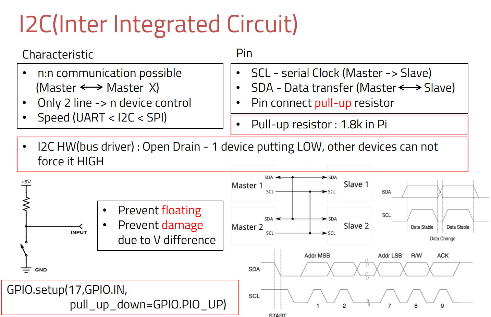

# Raspberri GPIO test

```shell
$ sudo apt-get install git-core
$ git clone git://drogon.net/wiringPi
$ cd wiringPi
$ ./build
```

Check that the file is installed well.

```shell
$ gpio-v gpio readall
```

And check the map of your raspberrypi GPIO.

```shell
$ gpio readall
```


Then, you can see the GPIO map below.



You can see that GPIO no.21 in BCM is port no.29 in wiringPi.

## 0. Cautions

#### Voltage limits

Raspberrypi has two types of input source. One is for 3.3V, and the other is for 5V, but if you construct a circuit using GPIO, 3.3V input source must be chosen. The reason is that Raspberrypi is only working on 3.3V environment, and there is no way to protect the circuit from voltage overflow. Overall, Raspberrypi must be managed on 3.3V environment(5V input source is only for USB input). Plus, it senses LOW from 0V to 0.7V and HIGH from 2.7V to 3.3V.

#### Current limits

3.3V pin current limit is maximum 30mA. If current overflow happens, Raspberrypi main circuit can be damaged.


## 1. LED

Below is the circuit for LED experiment.



Makefile

```shell
led:
	gcc -o ledtest led_test.c -lwiringPi
sw:
	gcc -o swtest sw_test.c -lwiringPi
```

led_test.c

```c
#include <stdio.h>
#include <wiringPi.h>

int main(){
    
    int i;
    if(wiringPiSetup() == -1) return -1;
    
    pinMode(29,OUTPUT);
    for(i=0; i < 5; i++){
        
        digitalWrite(29,1);
        delay(500);
        digitalWrite(29,0);
        delay(500);
    }
    return 0;
}
```

If the program is executed, you can see the LED flashes periodically at 0.5second intervals.

Here, add a switch to make LED off when it is pushed.



sw_test.c

```c
#include <stdio.h>
#include <wiringPi.h>

#define SW1 1 // BCM_GPIO 18
#define LED1 29 // BCM_GPIO 29

int main() {
    
    int i;
    
    if(wiringPiSetup() == -1) return -1;
    
    pinMode(SW1, INPUT);
    pinMode(LED1, OUTPUT);
    for(;;){
        
        if(digitalRead(SW1) == 1){
            printf("Switch open LED OFF\n");
            digitalWrite(LED1,0);
            delay(1000);
        }
        else {
            printf("Swtich close LED ON\n");
            digitalWrite(LED1, 1);
            delay(1000);
            
        }        
    }
    return 0;
}
```


You can see that LED is off when the switch is pushed.




## 2. Ultrasonic Wave Sensor

Below is the circuit for ultrasonic wave sensor experiment.

 



Here, it is important that sensor and echo port send 5V output signal, but GPIO input must be 3.3V one. Thus, you have to lower the voltage using 1k and 2k resistors.

Makefile

```c
ultra:
	gcc -o ultratest ultra_test.c -lwiringPi
```

Code

```c
#include <stdio.h>
#include <stdlib.h>
#include <wiringPi.h>

#define trig 28 // BCM 20
#define echo 29 // BCM 21

int main() {
    
    int start_time, end_time;
    float distance;
    
    if(wiringPiSetup() == -1) return -1;
    
    pinMode(trig, OUTPUT);
    pinMode(echo, INPUT);
    
    while(1) {
        
        digitalWrite(trig, LOW);
        delay(500);
        digitalWrite(trig, HIGH);
        delayMicroseconds(10);
        digitalWrite(trig, LOW);
        
        while (digitalRead(echo) == 0);
        start_time = micros();
        while (digitalRead(echo) == 1);
        end_time = micros();
        // us(micro sec) / 58 = centimeters (sensor date sheet)
        distance = (end_time - start_time) / 29. / 2. ;
        printf("Distance is %.2f cm\n", distance);
  	}
    return 0;
}
```

Below is the result.


## 3. SPI, I2C

### SPI



### I2C



