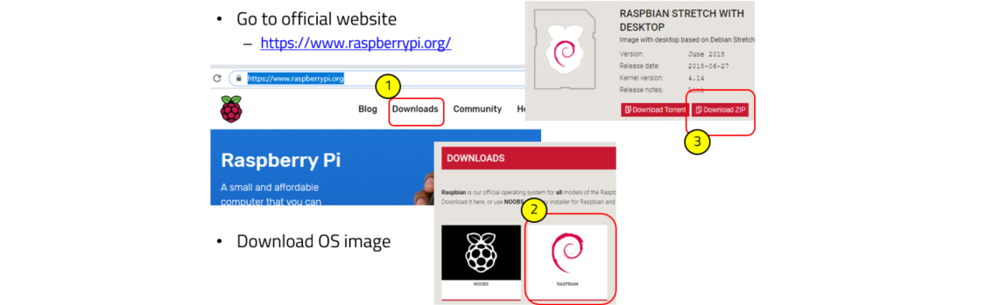
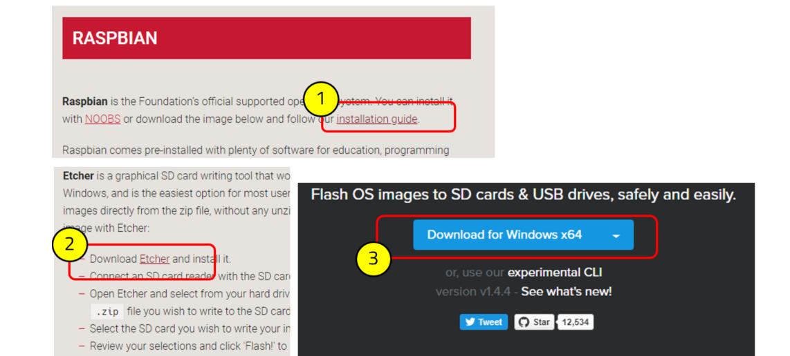
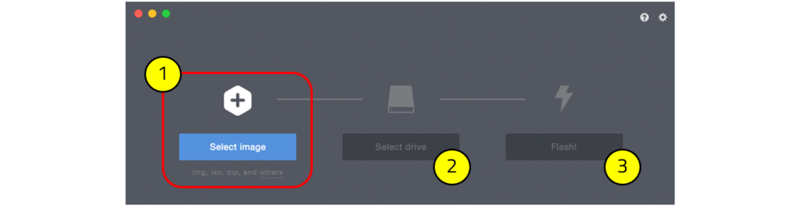
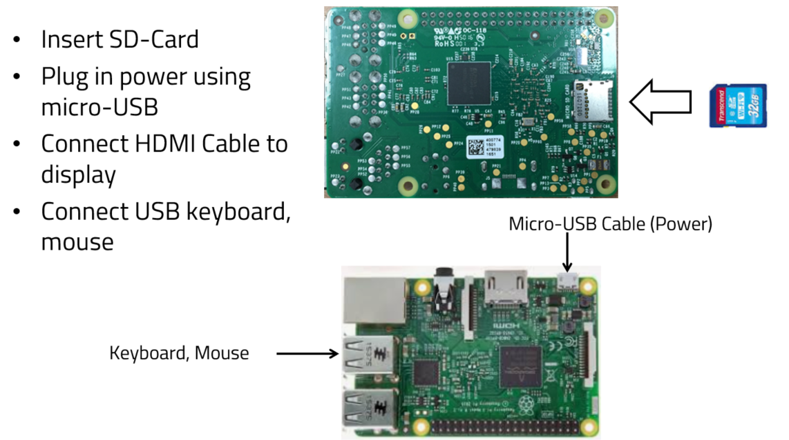
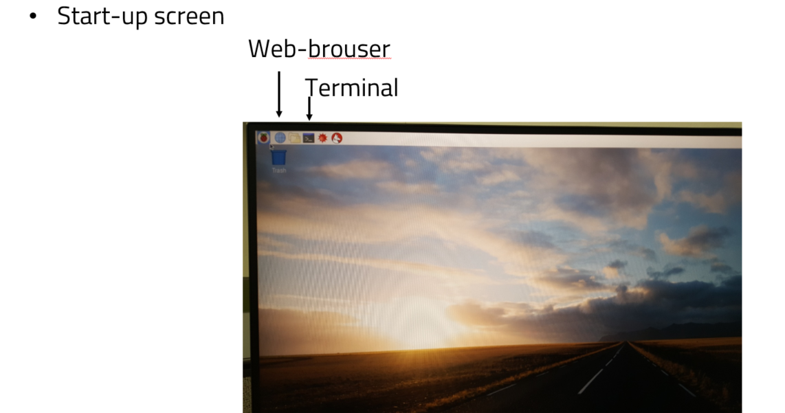
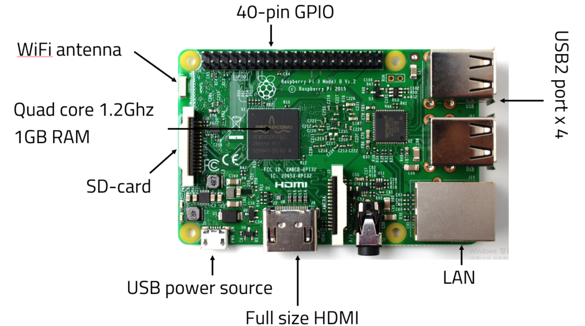
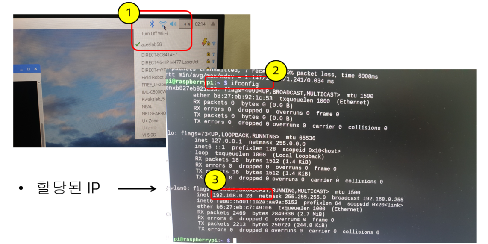
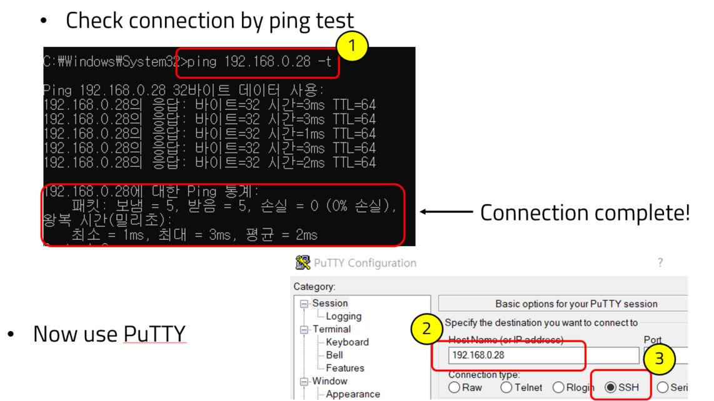
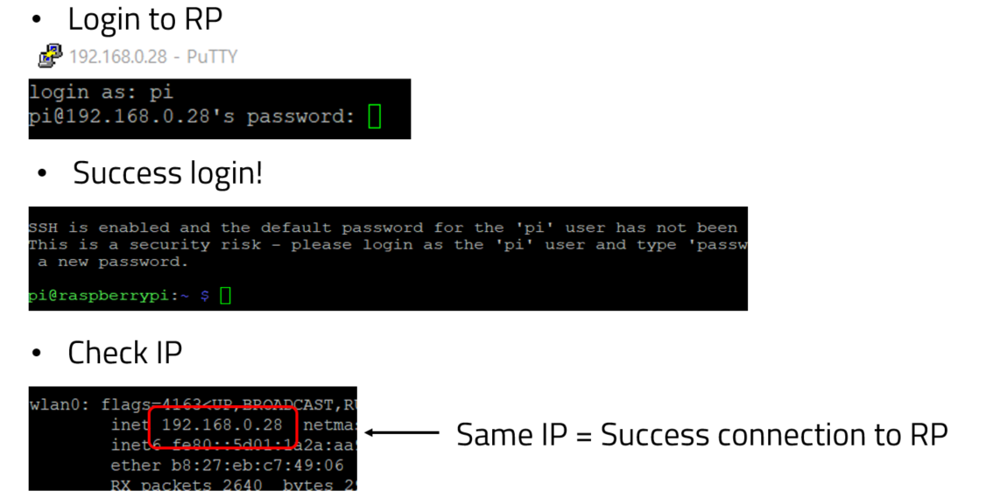

# Rasberrypi setup

## Preparation of OS

#### Download Operating System

Go to the official website –<https://www.raspberrypi.org/>

Read an installation guide –<https://www.raspberrypi.org/downloads/raspbian/>

Flash(Write) an OS image into a SD card

Boot Linux on SD card

You can see the start-up screen.

## Basic of RP

#### RP3 Model B Spec

#### Wi-Fi Setup

Like connecting an Wi-Fi on PC, you can connect a Wi-Fi on the raspberrypi OS GUI.

#### Connect to RP via SSH

If you complete connecting RP and host PC, then login to RP.

You can see the connection status between RP and host PC!

