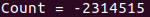
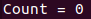

## Background

According to Wikipedia, **threads** differ from traditional multitasking OS processes in several ways. One of them is that context switching between threads in the same process typically occurs faster than context switching between processes. But, in a case of the following example, there is a problem while context switching happens.

If two threads add 1 to a shared variable "count", they are executed by the following sequence.

1) Store a value of shared variable "count" on a register.

2) Add 1 to a value stored on the register.

3) Load the value to memory.

There is no way to ensure which thread will be executed. If they are executed like the table below, the final value of "count" will be 2.

| Thread # | Operation     | "count" | Register1(Reg1) | Register2(Reg2) |
| -------- | ------------- | ------- | --------------- | --------------- |
| Thread1  | "count"->Reg1 | 0       | 0               |                 |
| Thread1  | Reg1=Reg1+1   | 0       | 1               |                 |
| Thread1  | Reg1->"count" | 1       | 1               |                 |
| Thread2  | "count"->Reg1 | 1       | 1               | 1               |
| Thread2  | Reg1=Reg1+1   | 1       | 1               | 2               |
| Thread2  | Reg1->"count" | 2       | 1               | 2               |

But, in the following case, it doesn't work well.

| Thread # | Operation     | "count" | Register1(Reg1) | Register2(Reg2) |
| -------- | ------------- | ------- | --------------- | --------------- |
| Thread1  | "count"->Reg1 | 0       | 0               |                 |
| Thread2  | "count"->Reg1 | 0       | 0               | 0               |
| Thread1  | Reg1=Reg1+1   | 0       | 1               | 0               |
| Thread2  | Reg1=Reg1+1   | 0       | 1               | 1               |
| Thread1  | Reg1->"count" | 1       | 1               | 1               |
| Thread2  | Reg1->"count" | 1       | 1               | 1               |

This problem is called a race condition. We can solve this issue using **semaphores**.


## Goals

1. Using C language, let's build a program composed of two threads which share the variable "count".
2. Using semaphores, let's solve a race condition issue.


## Goal1

First, let's build a basic structure, main function and libraries.

```c
#include <stdio.h>
#include <stdlib.h>

int main(){
  return 0;
}
```


Second, state and define two functions that will be used as threads.

```c
#include <stdio.h>
#include <stdlib.h>

void* thread1(void *arg);
void* thread2(void *arg);

int main(){
  return 0;
}

void* thread1(void *arg){
  for(int i = 0 ; i < 1000000000 ; i++){
    count++;
  }
}

void* thread1(void *arg){
  for(int i = 0 ; i < 1000000000 ; i++){
    count--;
  }
}
```


Third, let's create threads(Refer to the manual, e.g. input "man 3 pthread_create" on a terminal).

```c
#include <stdio.h>
#include <stdlib.h>
#include <pthread.h>

void* thread1(void *arg);
void* thread2(void *arg);

int main(){
  pthread_t a_thread, b_thread;
  int res;
  void* thread_result;
  
  res = pthread_create(&a_thread, NULL, thread1, NULL);
  res = pthread_create(&b_thread, NULL, thread2, NULL);
  
  res = pthread_join(a_thread, &thread_result);
  res = pthread_join(b_thread, &thread_result);
  
  return 0;
}

void* thread1(void *arg){
  for(int i = 0 ; i < 1000000000 ; i++){
    count++;
  }
}

void* thread1(void *arg){
  for(int i = 0 ; i < 1000000000 ; i++){
    count--;
  }
}
```


Fourth, using both threads, let's apply them to the variable "count".

```c
#include <stdio.h>
#include <stdlib.h>
#include <pthread.h>

void* thread1(void *arg);
void* thread2(void *arg);

int count;

int main(){
  pthread_t a_thread, b_thread;
  int res;
  void* thread_result;
  
  res = pthread_create(&a_thread, NULL, thread1, NULL);
  res = pthread_create(&b_thread, NULL, thread2, NULL);
  
  res = pthread_join(a_thread, &thread_result);
  res = pthread_join(b_thread, &thread_result);
  
  printf("Count = %d\n", count);
  
  return 0;
}

void* thread1(void *arg){
  for(int i = 0 ; i < 1000000000 ; i++){
    count++;
  }
}

void* thread1(void *arg){
  for(int i = 0 ; i < 1000000000 ; i++){
    count--;
  }
}
```


Fifth, let's compile it("-lpthread" option must be added). Input the following instructions on a terminal.

```
>> gcc thread.c -lpthread -o thread
>> ./thread
```


Then, I can check the unintended result(count is not a zero).




## Goal2

Using semaphores, let's solve this race condition issue.


First, state a semaphore variable and initiate semaphore(get help using "man 3 sem_init").

```c
#include <stdio.h>
#include <stdlib.h>
#include <pthread.h>
#include <semaphore.h>

void* thread1(void *arg);
void* thread2(void *arg);

int count;
sem_t bin_sem; // Semaphore variable

int main(){
  pthread_t a_thread, b_thread;
  int res;
  void* thread_result;
  
  res = sem_init(&bin_sem, 0, 1);
  
  res = pthread_create(&a_thread, NULL, thread1, NULL);
  res = pthread_create(&b_thread, NULL, thread2, NULL);
  
  res = pthread_join(a_thread, &thread_result);
  res = pthread_join(b_thread, &thread_result);
  
  printf("Count = %d\n", count);
  
  return 0;
}

void* thread1(void *arg){
  for(int i = 0 ; i < 1000000000 ; i++){
    count++;
  }
}

void* thread1(void *arg){
  for(int i = 0 ; i < 1000000000 ; i++){
    count--;
  }
}
```


Second, make blocks using sem_wait and sem_post to protect shared variable "count".

```c
#include <stdio.h>
#include <stdlib.h>
#include <pthread.h>
#include <semaphore.h>

void* thread1(void *arg);
void* thread2(void *arg);

int count;
sem_t bin_sem; // Semaphore variable

int main(){
  pthread_t a_thread, b_thread;
  int res;
  void* thread_result;
  
  res = sem_init(&bin_sem, 0, 1);
  
  res = pthread_create(&a_thread, NULL, thread1, NULL);
  res = pthread_create(&b_thread, NULL, thread2, NULL);
  
  res = pthread_join(a_thread, &thread_result);
  res = pthread_join(b_thread, &thread_result);
  
  printf("Count = %d\n", count);
  
  return 0;
}

void* thread1(void *arg){
  for(int i = 0 ; i < 1000000000 ; i++){
    sem_wait(&bin_sem);
    count++;
    sem_post(&bin_sem);
  }
}

void* thread1(void *arg){
  for(int i = 0 ; i < 1000000000 ; i++){
    sem_wait(&bin_sem);
    count--;
    sem_post(&bin_sem);
  }
}
```


Third, destroy semaphore using sem_destroy.

```c
#include <stdio.h>
#include <stdlib.h>
#include <pthread.h>
#include <semaphore.h>

void* thread1(void *arg);
void* thread2(void *arg);

int count;
sem_t bin_sem; // Semaphore variable

int main(){
  pthread_t a_thread, b_thread;
  int res;
  void* thread_result;
  
  res = sem_init(&bin_sem, 0, 1);
  
  res = pthread_create(&a_thread, NULL, thread1, NULL);
  res = pthread_create(&b_thread, NULL, thread2, NULL);
  
  res = pthread_join(a_thread, &thread_result);
  res = pthread_join(b_thread, &thread_result);
  
  printf("Count = %d\n", count);
  
  sem_destroy(&bin_sem);
  
  return 0;
}

void* thread1(void *arg){
  for(int i = 0 ; i < 1000000000 ; i++){
    sem_wait(&bin_sem);
    count++;
    sem_post(&bin_sem);
  }
}

void* thread1(void *arg){
  for(int i = 0 ; i < 1000000000 ; i++){
    sem_wait(&bin_sem);
    count--;
    sem_post(&bin_sem);
  }
}
```


Fourth, let's compile it("-lpthread" option must be added). Input the following instructions on a terminal.

```
>> gcc thread.c -lpthread -o thread
>> ./thread
```


Then, the issue is solved!




## Next Issue

Upcoming issue will be synchronization issue. It will be updated ...