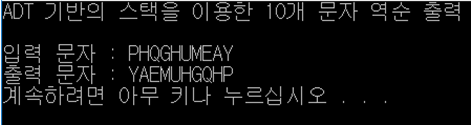

## Index

#### 1. Definition

#### 2. Problem

#### 3. Algorithm

#### 4. How to Use?

#### 5. Conclusion

#### 

## 1. Definition

According to Wikipedia, a **stack** is a basic data structure that can be logically thought of as a linear structure represented by a real physical stack or pile, a structure where insertion and deletion of items takes place at one end called top of the stack. The basic concept can be illustrated by thinking of your data set as a stack of plates or books where you can only take the top item off the stack in order to remove things from it. This structure is used all throughout programming.

The basic implementation of a stack is also called a LIFO (Last In First Out) to demonstrate the way it accesses data, since as we will see there are various variations of stack implementations.


## 2. Problem

Build a stack algorithm and print out input strings in a reverse order.

For example,

> Input : ABCDEFGHIJK
>
> Output : KJIHGFEDCBA


## 3. Algorithm

First, define "node" and meta-structure "struct"

```c
typedef struct node
	{
	void* dataptr;
	struct node* link;

	} STACK_NODE;

typedef struct
	{
	int count;
	STACK_NODE* top;

	}STACK;
```


Second, build functions: createStack, pushStack, popStack, stackTop, emptyStack, fullStack, stackCount, destroyStack, insertData, and print.

```c
STACK* createStack(void)
{
	STACK* stack;

	stack = (STACK*)malloc(sizeof(STACK));
	if (stack)
	{
		stack->count = 0;
		stack->top = NULL;

	}
	return stack;
} 
```

```c
bool pushStack(STACK* stack, void* dataInPtr) 
{
	STACK_NODE* newPtr;

	newPtr = (STACK_NODE*)malloc(sizeof(STACK_NODE));
	if (!newPtr)
		return false;

	newPtr->dataptr = dataInPtr;
	newPtr->link = stack->top;
	stack->top = newPtr;
	
	(stack->count)++;
	return true;

}
```

```c
void* popStack(STACK* stack)
{
	void* dataOutPtr;
	STACK_NODE* temp;

	if (stack->count == 0)
		dataOutPtr = NULL;
	else
	{
		temp = stack->top;
		dataOutPtr = stack->top->dataptr;
		stack->top = stack->top->link;
		free(temp);
		(stack->count)--;
	}
	return dataOutPtr;

}
```

```c
void* stackTop(STACK* stack)
{
	if (stack->count == 0)
		return NULL;
	else
		return stack->top->dataptr;

}
```

```c
bool emptystack(STACK* stack)
{
	return(stack->count == 0);

}
```

```c
bool fullStack(STACK* stack)
{
	STACK_NODE* temp;

	if ((temp = (STACK_NODE*)malloc(sizeof(*(stack->top)))))
	{
		free(temp);
		return false;

	}

	return true;

}
```

```c
int stackCount(STACK* stack)
{
	return stack->count;

}
```

```c
STACK* destroyStack(STACK* stack)
{
	STACK_NODE* temp;

	if (stack)
	{
		while (stack->top != NULL)
		{
			free(stack->top->dataptr);
			temp = stack->top;
			stack->top = stack->top->link;
			free(temp);
		} 
		free(stack);

	}
	return NULL;
}
```

```c
void insertData(STACK* stack)
{
	char charIn;
	
	printf("입력 문자 : ");
	
	if (fullStack(stack))
	{
		printf("Error 100: Out of Memory\n");
		exit(100);
	}

	for (int nodeCount = 0; nodeCount < 10; nodeCount++)
	{
		charIn = rand() % 26 + 'A';
		pushStack(stack, (char*)charIn);
		printf("%c", charIn);
	}
	printf("\n");

}
```

```c
void print (STACK* stack)
{
	char* charOut;

	printf("출력 문자 : ");

	while(!emptystack(stack))
	{
		charOut = (char*)popStack(stack);
		printf("%c", charOut);
	}

	printf("\n");
}
```


Third, build a main function.

```c
int main(void)
{
	STACK* stack;

	stack = createStack();

	printf("스택을 이용한 10개 문자 역순 출력\n\n");

	insertData(stack);
	print(stack);

	return 0;
}
```


## 4. How to Use?

First, compile Stack.c

```c++
gcc -o Stack Stack.c
```


Second, execute the program.

```
sudo ./Stack
```


## 5. Conclusion

You can check the conclusion: Ten random alphabets and the ones in reverse order than the input data.



